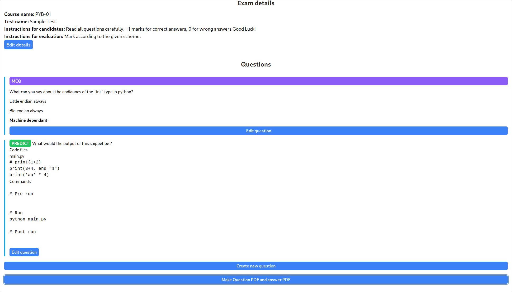
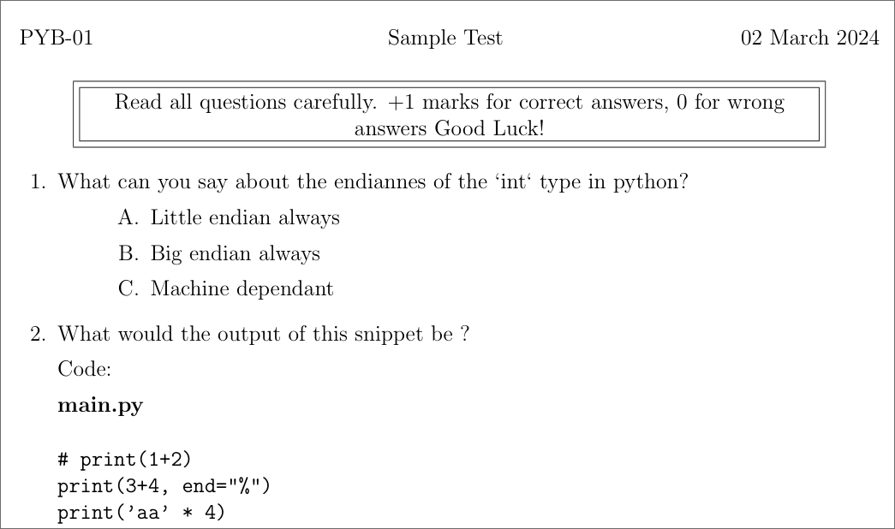
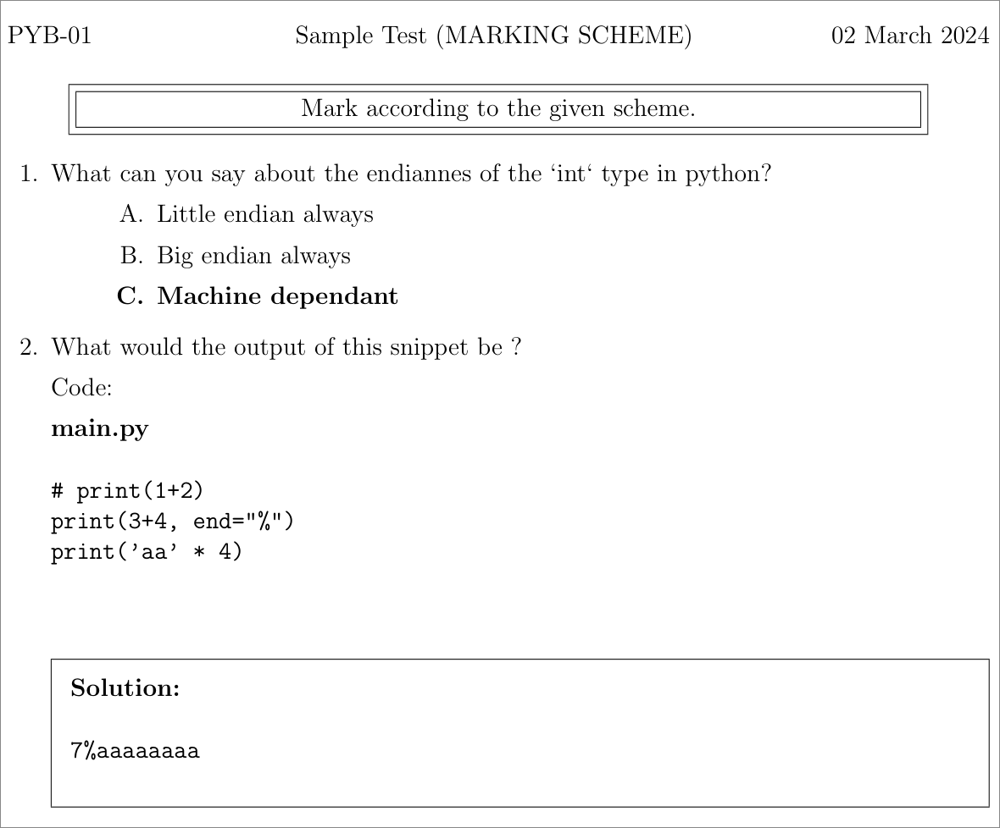

# examsh

`examsh` is a app to generate exam papers (and marking schemes)

Written in [rust](https://www.rust-lang.org/) and
[svelte](https://kit.svelte.dev/) using [tauri](https://tauri.app/)

Currently `examsh` uses LaTeX to render the PDFs, the eventual plan is to use
[typst](https://typst.app/) instead since its much easier to write in. It's
written in rust as well, so in future `examsh` could ship a typst binary (which
is super small) alongside it.

## Screenshots

- Sample [exam.pdf](./res/exam.pdf)
- Sample [marking.pdf](./res/marking.pdf)

## Features

`examsh` has a few "types" of questions

1. Predicting the output: Where the student is required to read the code
   snippet provided and figure out what the output is
2. Writing code: Where the student is required to write a piece of code (**STILL WIP**)
3. Multiple Choice Questions

## Main use case

I use this app to generate exam papers which mainly contain questions where
students need to analyse the given code snippet and come up with the output. I
feel that being able to look at a peice of code and be able to mentally come up
with a output is a useful techinque to know about, especially for new
developers. Analysis skills also help new developers to think more about the
code and be able to make a better mental map of the code.

I find that making the marking scheme (especially for predicting questions) is
kind of hard because of:
1. The code in question might change, leading to the marking scheme becoming
   out-of-sync
2. Instructors are human too and they might make a mistake (either with writing
   the code, or writing the wrong answer in the marking scheme)

## WIP

This project is still WIP. You are welcome to suggest ideas, but I'm pretty
busy already so I might not be able to incorporate all your features. Also,
this application is pretty tailor-made to my workflow so drastic workflow
changing features are unlikely to be accepted.
